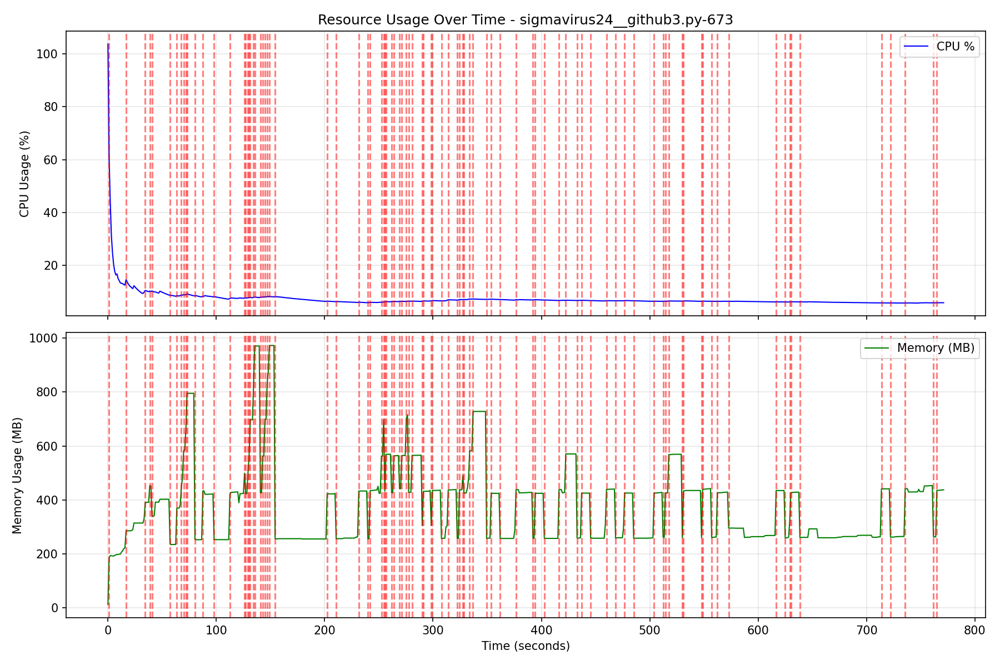
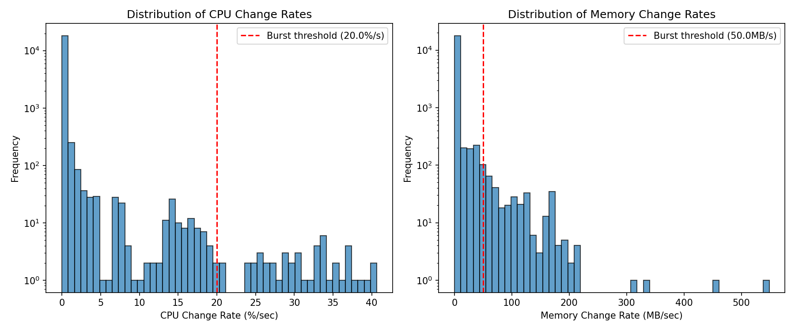
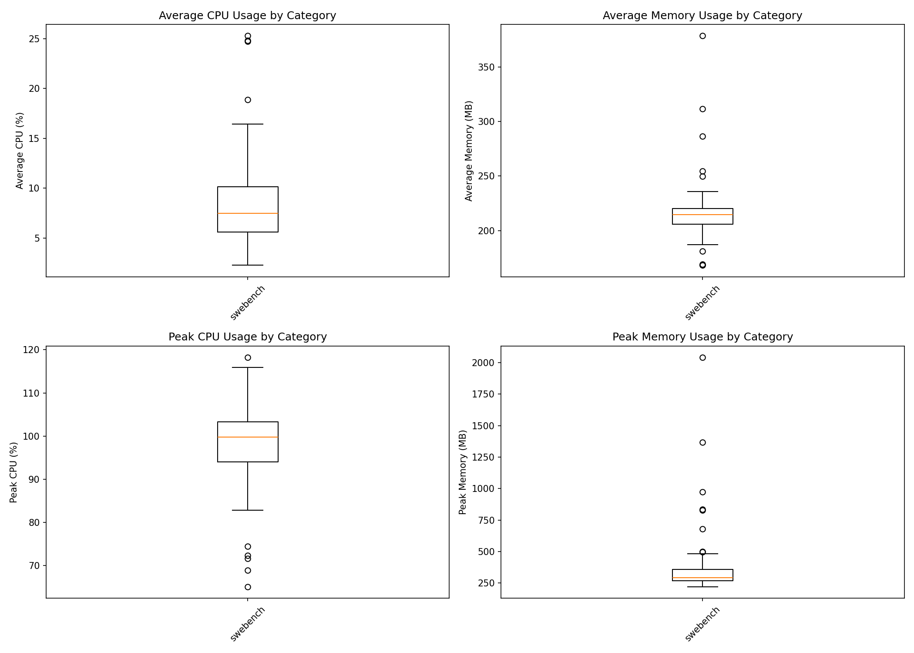
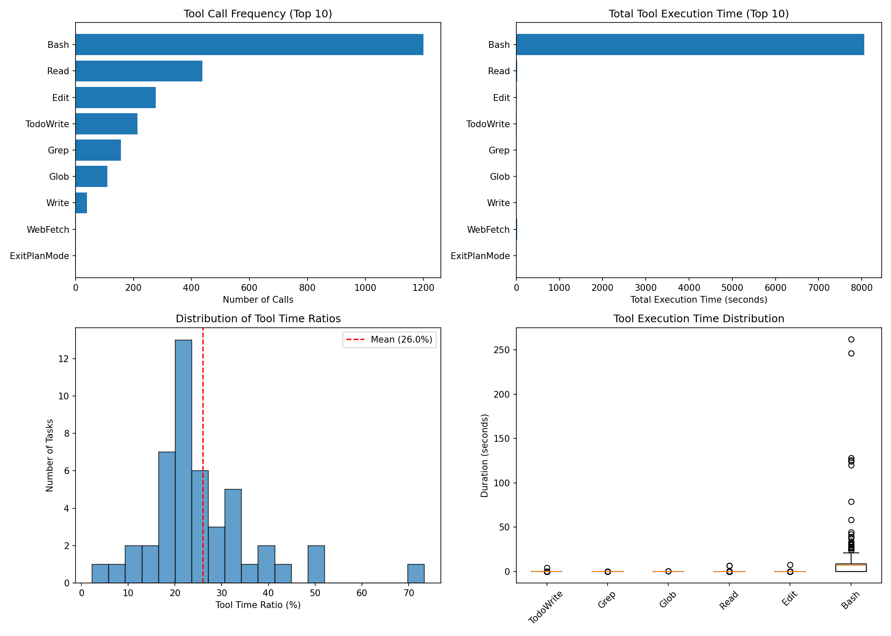
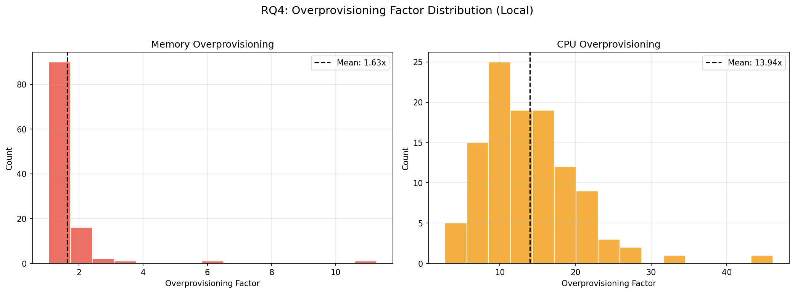

# AgentCgroup SWE-Bench Experiment Analysis Report (qwen3)

Generated: 2026-02-05 23:48:33

Data source: `/home/yunwei37/agentcgroup/experiments/all_images_local`

Total tasks analyzed: 47

## Dataset Overview

| Metric | Value |
|--------|-------|
| Total tasks | 47 |
| Successful | 29 (61.7%) |
| Total execution time | 30111.1s (501.9 min) |

## RQ1: Resource Usage Dynamics (Time-scale Mismatch)

**Research Question**: How dynamic are resource changes during AI agent execution?

**Paper Claim**: User-space controllers react in 10-100ms, but resource changes happen at millisecond scale.

### Findings

- **Total burst events detected**: 352
- **Tasks with bursts**: 47 / 47

**CPU Change Rate Statistics (%/sec)**:
- Mean: 0.28
- Max: 40.65
- 95th percentile: 0.50

## RQ2: Resource Usage by Category (Domain Mismatch)

**Research Question**: Do different task categories have significantly different resource needs?

**Paper Claim**: Static resource limits cannot adapt to different workloads.

### Memory Usage by Category

| Category | N | Avg Memory (MB) | Peak Memory (MB) |
|----------|---|-----------------|------------------|
| swebench | 47 | 214.8 | 834.4 |

## RQ3: Tool Call Patterns

**Research Question**: What is the relationship between tool calls and resource consumption?

### Top Tools by Execution Time

| Tool | Call Count | Total Time (s) | Avg Time (s) |
|------|------------|----------------|--------------|
| Bash | 1200 | 8052.46 | 6.71 |
| Read | 438 | 20.59 | 0.05 |
| WebFetch | 1 | 18.47 | 18.47 |
| Edit | 277 | 15.37 | 0.06 |
| TodoWrite | 214 | 8.27 | 0.04 |
| Write | 40 | 5.83 | 0.15 |
| Grep | 157 | 4.41 | 0.03 |
| Glob | 109 | 3.36 | 0.03 |
| ExitPlanMode | 1 | 0.04 | 0.04 |

**Tool Time Ratio**: Mean 26.0%, Median 23.2%

## RQ4: Over-provisioning Analysis

**Research Question**: How much over-provisioning would static limits require?

### Over-provisioning Factors

| Metric | CPU Ratio | Memory Ratio |
|--------|-----------|--------------|
| Mean | 12.15x | 1.53x |
| Median | 10.48x | 1.43x |
| Max | 26.92x | 3.34x |
| 95th Percentile | 21.90x | 2.13x |

## Key Conclusions

1. **Time-scale Mismatch**: Resource usage exhibits significant burstiness that exceeds 
   the reaction time of typical user-space controllers.
2. **Domain Mismatch**: Different task categories show distinct resource profiles, 
   making static limits suboptimal.
3. **Over-provisioning Waste**: Static provisioning at peak levels wastes significant resources,
   as average usage is typically much lower than peak.