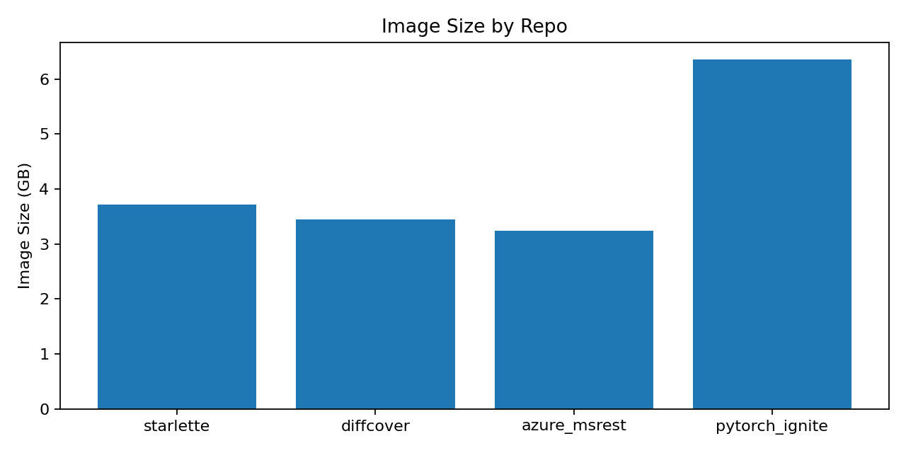
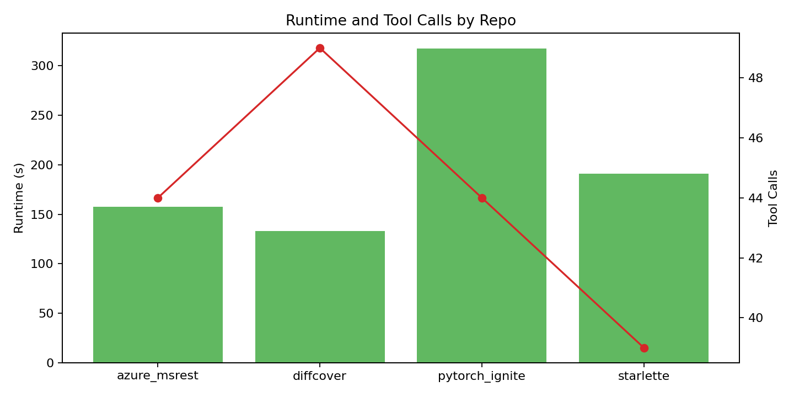
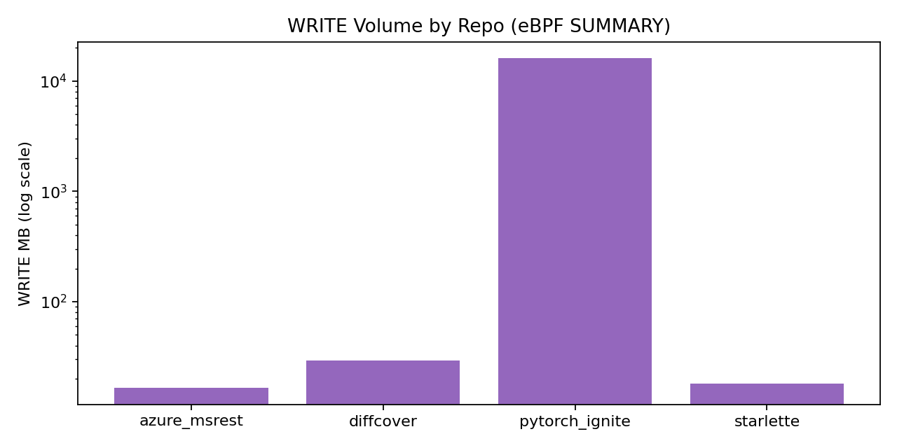
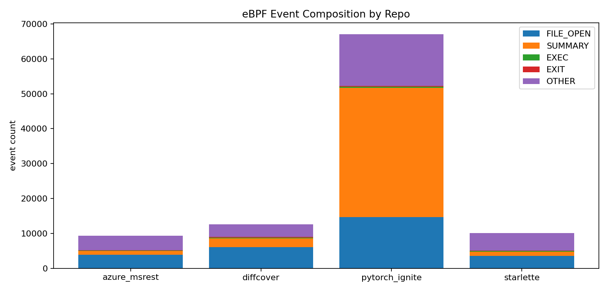
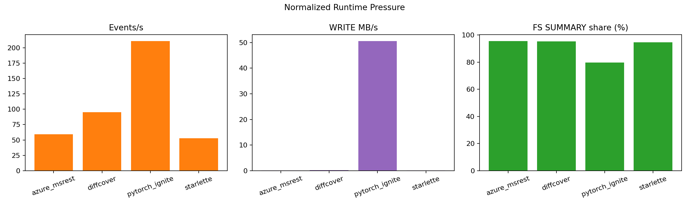
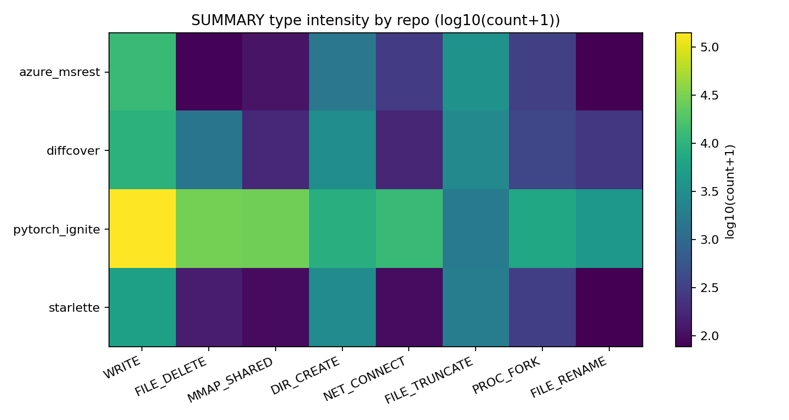
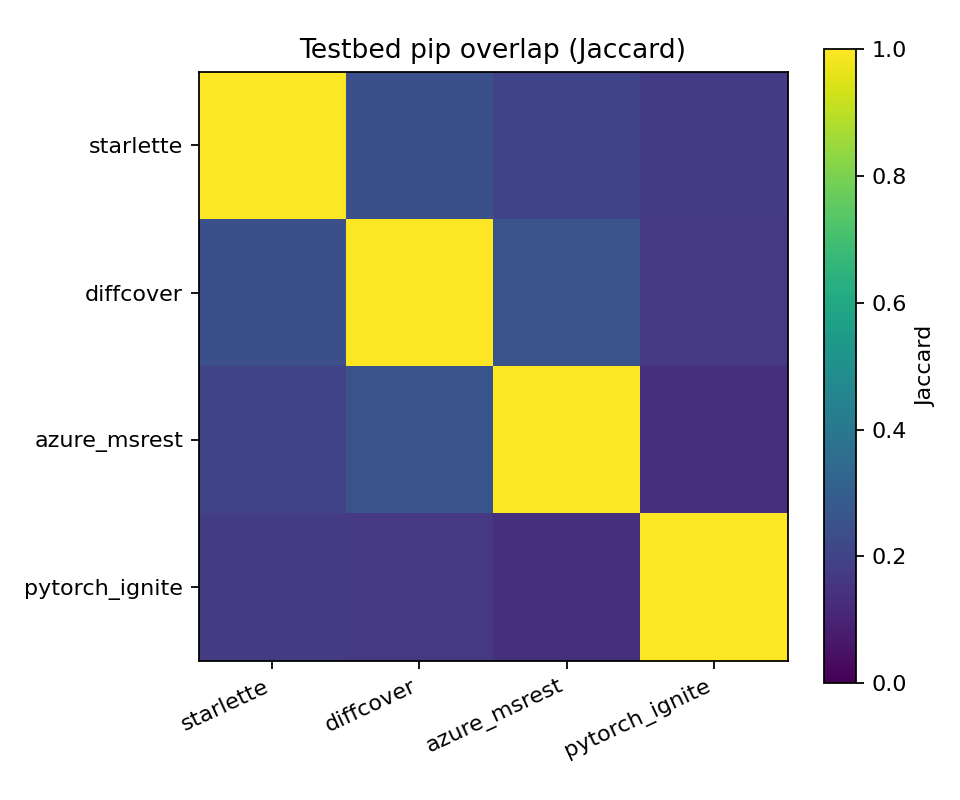
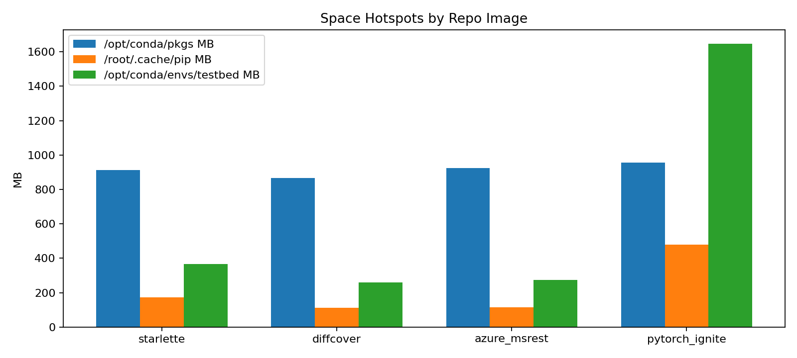
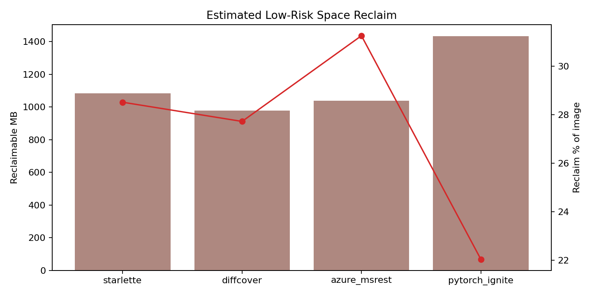
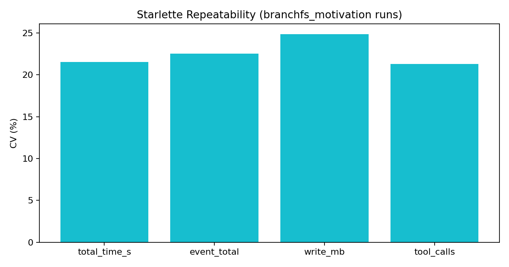

# 面向 Agentic 软件工程任务的跨仓库容器开销实证研究

## 摘要
面向软件工程任务的 LLM Agent 在容器化执行过程中会产生显著且异构的运行时开销。然而，传统 Agent 评估主要停留在任务成功率、工具调用轨迹与粗粒度资源统计，难以解释“不同仓库为何表现出数量级差异”。本文基于 AgentCgroup 与 AgentSight eBPF 追踪链路，对 4 个 SWE-bench 仓库镜像（`starlette`、`diff_cover`、`azure_msrest`、`pytorch_ignite`）开展统一配置下的实证分析。我们同时采集 syscall 级事件、容器资源序列、工具调用轨迹与镜像内部依赖结构，围绕跨仓库动态开销、依赖重叠度与可回收空间开展量化研究。结果显示：（1）跨仓库写入量差异可达 `971.9x`，`pytorch_ignite` 写入量达 `16062.33 MB`；（2）`testbed` 依赖重叠度较低（Jaccard `0.137~0.260`），单一统一依赖层策略受限；（3）仅清理 `conda/pip` 缓存即可回收约 `4533 MB`；（4）`starlette` 5 次重复实验的 CV 为 `0.21~0.25`，提示单次观测不足以支持稳健结论。基于上述发现，本文提出分层优化路径：短期缓存治理、中期镜像分族、长期构建链路标准化。

**关键词**：LLM Agent；SWE-bench；eBPF；容器镜像；依赖重叠；运行时开销；实证研究

## 1. 引言
AgentCgroup 的既有数据管线能够记录工具调用与容器级 CPU/内存，但缺少 syscall 级证据，使得“开销来源诊断”在跨仓库场景下解释力不足。具体而言，两个仓库即便工具调用次数相近，也可能因为依赖结构、文件系统写入模式、网络行为和进程协同方式不同，表现出截然不同的资源曲线与时延分布。

本文关注一个实践问题：在统一 agent 运行配置下，跨仓库差异到底来自哪里，以及哪些优化能够在不改变任务语义的前提下带来可验证收益。为此，我们将运行期与静态镜像两个视角统一起来：

1. 运行期：以 eBPF 采集 syscall 级行为，建立可解释的事件画像；
2. 静态期：以镜像内部依赖与目录体积分析定位冗余来源；
3. 联合分析：把行为差异映射到可执行的优化优先级。

## 2. 研究问题与贡献
### 2.1 研究问题
- **RQ1**：不同仓库镜像在真实 agent 运行下的动态开销差异有多大？
- **RQ2**：不同仓库镜像在依赖集合与层结构上的重叠度如何？
- **RQ3**：在不改变任务语义的前提下，能回收多少低风险空间？
- **RQ4**：单仓库重复运行的波动量级如何，是否影响跨仓库结论稳定性？

### 2.2 主要贡献
1. 提供跨仓库 syscall 级运行画像，补齐仅靠工具轨迹难以解释的行为差异。
2. 量化 `testbed` 依赖重叠边界，说明“单一统一依赖层”在 SWE-bench 多仓库场景中的局限。
3. 给出可操作的镜像瘦身收益估算（4 镜像约 `4533 MB`）。
4. 通过重复实验报告波动区间，为后续统计设计提供依据。

## 3. 方法
### 3.1 实验对象
本文覆盖 4 个 SWE-bench 仓库镜像：
1. `swerebench/sweb.eval.x86_64.encode_1776_starlette-1147`
2. `swerebench/sweb.eval.x86_64.bachmann1234_1776_diff_cover-210`
3. `swerebench/sweb.eval.x86_64.azure_1776_msrest-for-python-224`
4. `swerebench/sweb.eval.x86_64.pytorch_1776_ignite-1077`

### 3.2 运行配置
统一运行器：`scripts/run_swebench_new.py`。统一参数：
- `--trace-all --trace-cgroup-children`
- `--trace-resources --resource-detail`
- `--sample-interval 100`
- `--resource-monitor-interval 0.5`
- 模型：`haiku`

### 3.3 采集数据
每次运行输出：
- `run_manifest.json`：编排元数据
- `ebpf_trace.jsonl`：内核级事件
- `results.json`：时长、工具调用、资源摘要
- `resources.json`：资源时间序列
- `tool_calls.json`：工具调用轨迹

### 3.4 指标定义
动态指标：
- `runtime_s`：总时长
- `event_total`：eBPF 总事件数
- `write_mb`：SUMMARY:WRITE 总写入
- `event_per_s`、`write_mb_per_s`：归一化压力
- `fs_summary_share`：FS 相关 SUMMARY 占比

静态指标：
- `image_size_gb`
- `testbed_pip_count`
- `pip overlap (Jaccard)`
- `reclaim_mb = /opt/conda/pkgs + /root/.cache/pip`

统计补充指标：
- 变异系数 CV（重复实验）
- max/min 比率（异质性强度）

## 4. 实验结果
### 4.1 RQ1：跨仓库动态开销
| 仓库 | runtime_s | tool_calls | event_total | write_mb | event_per_s | write_mb_per_s | fs_summary_share_% | mem_avg_mb | cpu_avg_% |
|---|---:|---:|---:|---:|---:|---:|---:|---:|---:|
| azure_msrest | 157.41 | 44 | 9349 | 16.53 | 59.39 | 0.10 | 95.61 | 334.35 | 11.35 |
| diffcover | 132.89 | 49 | 12637 | 29.33 | 95.09 | 0.22 | 95.42 | 335.69 | 19.12 |
| pytorch_ignite | 317.35 | 44 | 67000 | 16062.33 | 211.13 | 50.61 | 79.74 | 476.82 | 42.30 |
| starlette | 190.79 | 39 | 10116 | 18.01 | 53.02 | 0.09 | 94.73 | 333.18 | 11.21 |

结论：
1. `pytorch_ignite` 在运行时长、事件强度与写入量上均显著更高。
2. 跨仓库写入量 max/min 比率约 `971.9x`，说明跨仓库分布呈强异质。
3. 非 ML 仓库的 FS 驱动特征明显（`fs_summary_share` 约 `95%`）。








### 4.2 RQ2：依赖重叠与镜像热点
| 仓库 | image_gb | layers | testbed_pip_count | /opt/conda MB | /opt/conda/pkgs MB | /root/.cache/pip MB | /opt/conda/envs/testbed MB |
|---|---:|---:|---:|---:|---:|---:|---:|
| azure_msrest | 3.24 | 6 | 40 | 1970 | 923 | 115 | 273 |
| diffcover | 3.45 | 17 | 57 | 1916 | 865 | 113 | 260 |
| pytorch_ignite | 6.35 | 6 | 134 | 3375 | 955 | 478 | 1646 |
| starlette | 3.71 | 6 | 85 | 2053 | 912 | 172 | 367 |

结论：
1. `testbed` pip 重叠度低到中等（Jaccard `0.137~0.260`），跨仓库依赖差异显著。
2. `/opt/conda/pkgs` 与 `/root/.cache/pip` 在所有镜像中均为稳定冗余热点。
3. `pytorch_ignite` 的 testbed 环境体积显著放大，解释其高写入与高时长现象的一部分。




### 4.3 RQ3：可优化空间
低风险可回收空间（`conda/pip` 缓存）合计约 `4533 MB`（4 镜像）。按镜像占比约 `22.0%~31.3%`。



优化建议：
1. **短期**：统一在构建末尾执行 cache clean。
2. **中期**：按 ML/非 ML 分族维护基础镜像，避免重型依赖外溢。
3. **长期**：统一构建链路与层划分，提升跨仓库层复用。

### 4.4 RQ4：重复性与稳定性
`starlette` 5 次历史有效运行结果：
- `runtime_s` CV = `0.22`
- `event_total` CV = `0.23`
- `write_mb` CV = `0.25`
- `tool_calls` CV = `0.21`

结论：单次运行存在中等波动，跨仓库比较应使用归一化指标并配合重复实验。



## 5. 相对原 AgentCgroup 数据的新增信息
相较于原有“工具轨迹 + 容器资源”的数据面，本文新增：
1. syscall 级 FS/NET/MMAP/PROC 行为证据；
2. 跨仓库写放大定量诊断（识别极端 outlier）；
3. `testbed` 依赖重叠边界（支持镜像策略决策）；
4. 路径级空间冗余估算（支持立刻执行的优化）。

## 6. 有效性威胁
1. 跨仓库主实验当前每仓库 1 次运行，统计显著性仍有限。
2. 运行开销由仓库结构与 agent 决策共同决定，当前尚未完全解耦。
3. 存储指标为镜像/路径级代理，未下钻到块级物理去重。
4. 重型 outlier（`pytorch_ignite`）会拉高整体均值，本文已补充归一化视角。

## 7. 结论与后续工作
本文证明：跨仓库开销差异不仅显著，而且在 syscall 级别可解释；镜像依赖重叠不足以支持单一依赖层策略；缓存治理可带来即时可验证收益。下一步将进行每仓库多次重复与 tracing 对照实验，补充置信区间与非参数检验，以提升结论的统计强度。

## 附录 A：图表索引
- 图1：`figures/fig1_image_sizes.png`
- 图2：`figures/fig2_runtime_toolcalls.png`
- 图3：`figures/fig3_write_volume_log.png`
- 图4：`figures/fig4_pip_overlap_heatmap.png`
- 图5：`figures/fig5_space_hotspots.png`
- 图6：`figures/fig6_event_mix_stacked.png`
- 图7：`figures/fig7_normalized_pressure.png`
- 图8：`figures/fig8_cache_reclaim.png`
- 图9：`figures/fig9_summary_heatmap.png`
- 图10：`figures/fig10_starlette_repeat_cv.png`

## 附录 B：核心复现命令（节选）
```bash
python scripts/run_swebench_new.py <image> \
  --model haiku \
  --trace-all --trace-cgroup-children \
  --trace-resources --resource-detail \
  --sample-interval 100 \
  --resource-monitor-interval 0.5

python experiments/empirical_study_20260305_full/build_report.py
```
